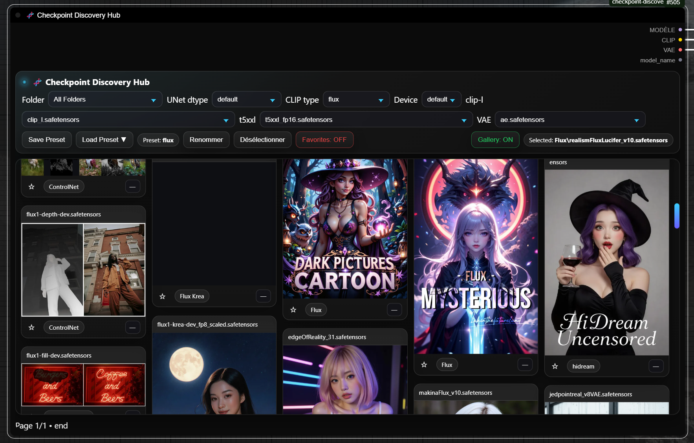

⭐ **Give a star, it shines and keeps us motivated! ✨**

# 🔬 ComfyUI-Checkpoint-Discovery-Hub


[☕ Support on Ko-fi](https://ko-fi.com/light_x02)

> Browse and manage your **checkpoints** directly inside **ComfyUI**. Discover models, sync metadata with **Civitai**, create presets, mark favorites, and filter by folders — all in a modern and responsive interface.

- **GitHub**: [https://github.com/Light-x02/ComfyUI-checkpoint-Discovery-Hub](https://github.com/Light-x02/ComfyUI-checkpoint-Discovery-Hub)
- **Node name in ComfyUI**: **Checkpoint Discovery Hub**



---

## ✨ Main Features

- **Model browser**: display checkpoints by folder and type.
- **Presets system**: save, rename, and reapply model setups instantly.
- **Favorites**: mark and filter only your starred checkpoints.
- **Civitai sync**: fetch metadata and preview images directly from Civitai.
- **Custom clip labels**: auto-renames CLIP 1/2 labels (e.g. *t5xxl*, *clip-l*).
- **Smart UI restore**: automatically remembers all selections after restart.
- **Modern design**: adaptive layout, quick access buttons, dark-themed interface.

---

## 🧩 Installation

### Method 1: Via ComfyUI Manager
1. Open **ComfyUI Manager**.
2. Go to **Custom Nodes**.
3. Search for **"ComfyUI-checkpoint-Discovery-Hub"** and install.
4. **Restart ComfyUI** to load the node.

### Method 2: Manual Installation
```bash
git clone https://github.com/Light-x02/ComfyUI-checkpoint-Discovery-Hub.git
```
Restart ComfyUI after cloning.

---

## 🚀 Usage

Outputs:
- **MODEL**, **CLIP**, and **VAE** with selected checkpoint configuration.
- All current selections are automatically saved and restored.

### Toolbar Controls
- **Folder**: filter by model directory.
- **UNet dtype / CLIP type / Device**: quick model configuration.
- **Save / Load Preset**: manage model setups.
- **Favorites**: toggle starred checkpoints.
- **Gallery ON/OFF**: collapse or expand the full model browser.

---

## 💾 Presets

- Save any setup (checkpoint, dtype, CLIP, VAE).
- Rename or clear your active preset.
- The last used preset is remembered between sessions.

---

## 🖼️ Civitai Integration

- **Sync**: fetch and save preview images and metadata for local models.
- **Open ↗**: directly open the Civitai page after syncing.

---

## ❤️ Credits

Created by [Light-x02](https://github.com/Light-x02)

> ⭐ Give a star if you like this project — it really helps and keeps the motivation high!

[☕ Support development on Ko-fi](https://ko-fi.com/light_x02)

